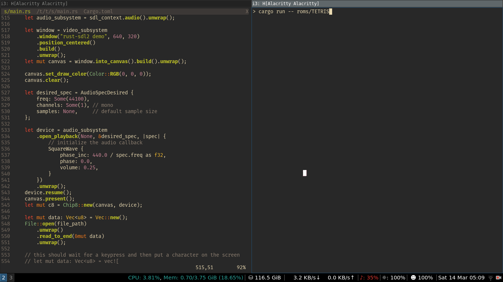

# chip8-rs
Chip-8 emulator, written in rust. Some freely available games are included in `roms` directory.



## Running

Requires SDL2 to be installed. On Ubuntu, run

```
sudo apt install libsdl2-dev
```

then

```
cargo run -- roms/TETRIS
```

## Resources

The following resources have been a huge help

- https://en.wikipedia.org/wiki/CHIP-8
- http://devernay.free.fr/hacks/chip8/C8TECH10.HTM
- http://www.multigesture.net/articles/how-to-write-an-emulator-chip-8-interpreter/
